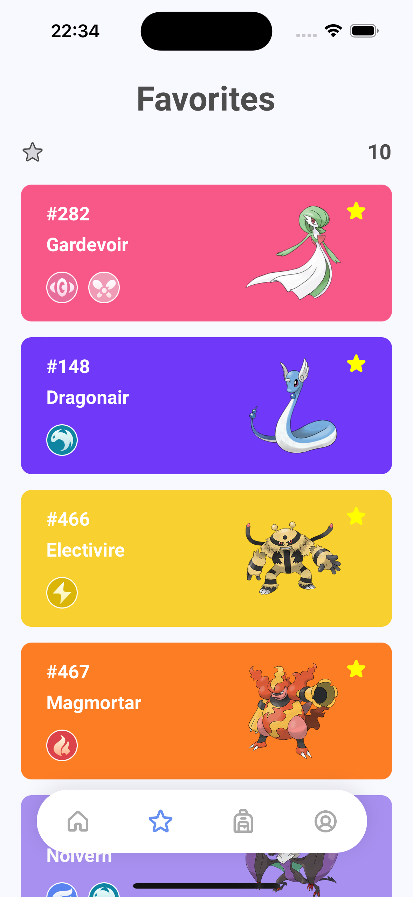

<h1 style="text-align: center; font-weight: bold;">Pokédex APP</h1>

<div align="center" >
  
</div>

## Sobre o Projeto

Está lançada a versão mobile da minha pokédex! Aqui você aprende tudo sobre os pokémons.

### Tecnologias Usadas

- [React Native](https://reactnative.dev/)
- [Expo](https://expo.dev/)
- [TypeScript](https://www.typescriptlang.org/)
- [Styled Components](https://styled-components.com/)
- [Native Base](https://nativebase.io/)
- [Axios](https://axios-http.com/ptbr/docs/intro)
- [React Router](https://reactrouter.com/en/main)
- [React Hook Form](https://react-hook-form.com/)
- [Poke API](https://pokeapi.co/)

### Como rodar a aplicação

```bash
# Clone este repositório
$ git clone https://github.com/marrcelosantana/pokedex-app
# Acesse a pasta do projeto
$ cd pokedex-app
# Instale as dependências
$ npm install
# Execute a aplicação em modo de desenvolvimento
$ expo start

```

### Imagens

|                 Login                 |                Home                 |                Favorites                 | Items                                |
| :-----------------------------------: | :---------------------------------: | :--------------------------------------: | ------------------------------------ |
|  |  |  |  |

|                 About                  |                  Stats                   |                  Forms                   | Shiny                                    |
| :------------------------------------: | :--------------------------------------: | :--------------------------------------: | ---------------------------------------- |
|  |  |  |  |
